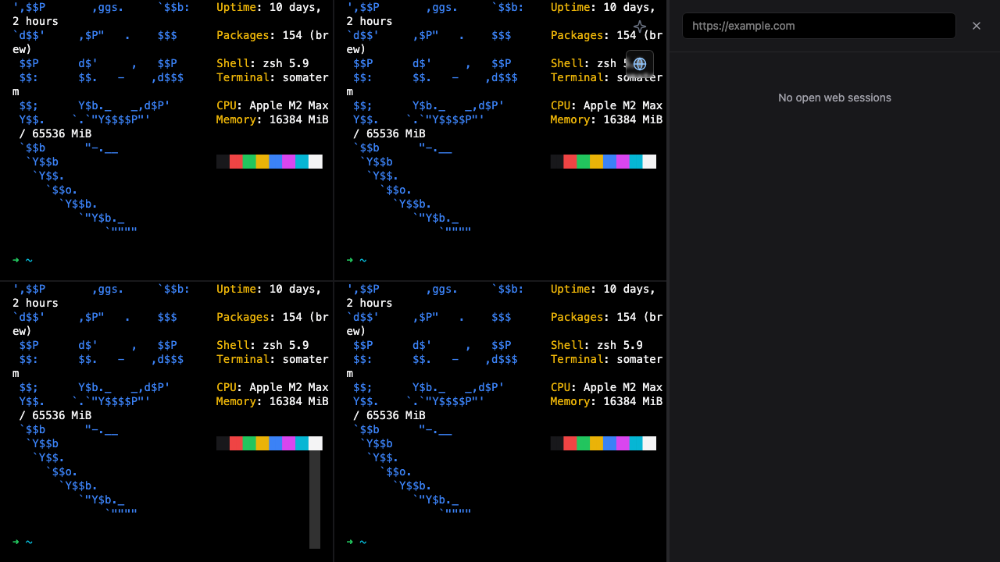

# Somaterm

> **A next-generation, AI-first terminal and desktop command center.**




## Description & Philosophy

Somaterm is built from the ground up to be the ultimate UI for orchestrating local autonomous AI agents (such as Python-based agent frameworks or local LLMs via Ollama) while delivering a robust, highly performant developer workspace. 

Engineered with software quality and robustness in mind, Somaterm seamlessly blends a native, high-speed terminal experience with intuitive web management capabilities and deep AI integration. It is designed to get out of your way, offering a zero-distraction UI that allows you to focus purely on your code, system operations, and AI orchestration.

## Key Features

- **Multi-Terminal Grid Layout:** Run up to 4 concurrent, resilient shell instances in a beautifully resizable grid.
- **Integrated Web Manager:** Includes hibernation-aware webviews designed for rigorous RAM optimization and maximum efficiency.
- **AI Agent Orchestration Ready:** Built-in communication panels tailored specifically for monitoring and interacting with local AI agents.
- **Zero-Distraction UI:** Features smart auto-hiding HUDs, transparent badges, and a sleek dark/emerald aesthetic.
- **Fully Automated E2E Testing:** A complete Playwright testing infrastructure is included for seamless visual regression testing and asset generation.

## Demo


## Getting Started

Follow these steps to set up the development environment and run Somaterm locally.

### Prerequisites

Ensure you have the following installed on your system:
- **Node.js** (v18 or higher recommended)
- **Rust** (Install via [rustup](https://rustup.rs/))
- **System Dependencies** for Tauri v2 (refer to the [official Tauri prerequisites guide](https://v2.tauri.app/start/prerequisites/))

### Installation

Clone the repository and install the Node.js dependencies:

```bash
git clone https://github.com/ebravo90/somaterm.git
cd somaterm
npm install
```

### Running the App

Boot up the Vite development server alongside the native Tauri shell:

```bash
npm run tauri dev
```

### Running Tests & Generating Assets

We use Playwright to automate end-to-end testing and generate beautiful, populated visual assets (like the screenshot above).

To run the test suite and regenerate the assets:

```bash
npx playwright test
```
